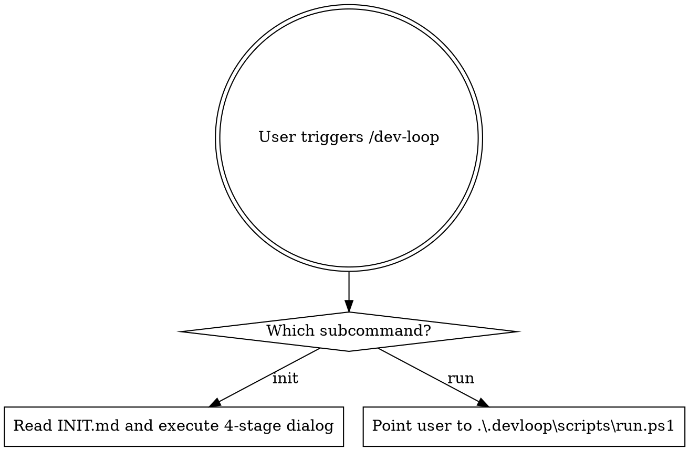

# Dev-Loop Skill

两阶段 harness：init 四段对话生成 `.devloop/` 工作流，`run.ps1` 驱动 headless Claude 循环执行任务。

## 决策流程图

## 两个入口命令

- `/dev-loop init` — 交互式四段对话生成完整 harness（Read `INIT.md`）
- `/dev-loop run` — 提示用户从 PowerShell 执行 `.\.devloop\scripts\run.ps1`（Claude 不在会话内循环）

## 必读文档（按需）

- `INIT.md` — init 阶段 Claude 主动 Read
- `RUN.md` — run 阶段 headless Claude 冷启动时 Read
- `CRITICAL_REVIEW.md` — CR Gate 判定准则与 v0.1.6 双路径事务边界
- `CHANGELOG.md` — 当前版本行为变更记录

当前事实源：运行行为以 `scripts/`、`templates/`、`INIT.md`、`RUN.md`、
`CRITICAL_REVIEW.md` 和 `CHANGELOG.md` 为准。
`docs/specs/`、`docs/plans/` 是 v0.1 初始设计/实施归档，不再作为现行 SSoT。

## 绝不做的事（红线）

1. 禁止直接创建 task.json 而跳过 INIT.md 的 4 段对话
2. 禁止在未触发 CR-2（证据等级审查）的情况下生成 architecture.md
3. 禁止把 run.ps1 的循环逻辑写进 Claude 对话里"自己循环"——Claude 不负责循环调度
4. 禁止自动 push / 自动 PR
5. 禁止修改已落盘的 `.devloop/config.json`（init 一次写入，run 阶段只读）
6. 禁止为了过 CR gate 而伪造查证记录——CR-5 允许 `NO_RESEARCH_NEEDED` 诚实出口

## 引用资料

按需查阅 `references/` 目录：
- `schemas.md` — task.json / config.json 完整 JSON Schema
- `failure-playbook.md` — 失败策略决策树（a2+b1+c1）
- `headless-gotchas.md` — Windows + headless Claude 已知坑
- `evidence-levels.md` — A/B/C 证据等级判定与升级流程
- `task-granularity.md` — 粗粒度 + 5 文件约束判例
- `browser-testing.md` — v0.1.2+ UI/浏览器 E2E 验证实现说明
- `ROADMAP.md` — v0.2+ 扩展计划
